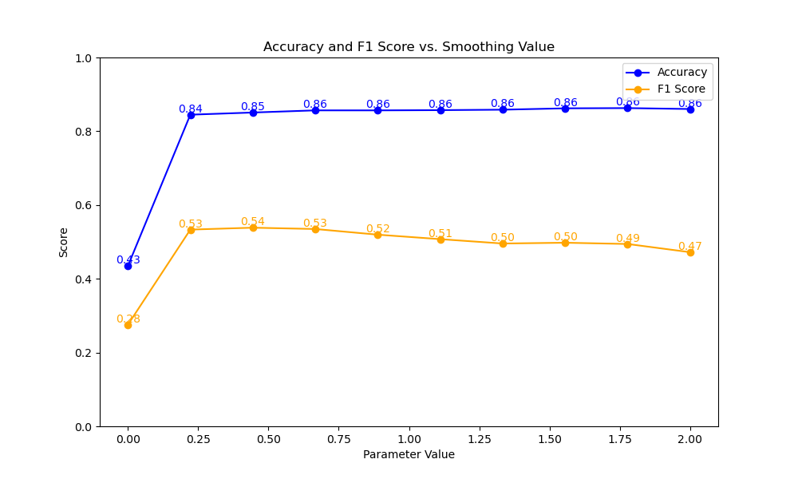
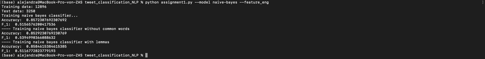
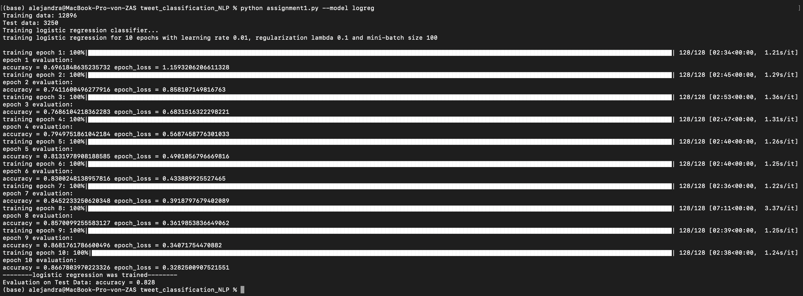

 
# Assignment 1 - ANLP
## Alejandra Camelo Cruz - 800385
## Universität Potsdam

### 1. Naive Bayes

#### - K smoothing Value 

I tried different 10 evenly spaced values from 0 to 2 for the k smoothing constant. Without smoothing at all, the model works poorly, in this case with accuracy of 0,43 and 0.28 F1-score. As far as some smoothing is added. The model performs clearly better, although the tradeoff between Accuracy and F_1 is compromised with higher values: Accuracy goes higher and F1 goes lower. Probably, the best value was around k = 0,75 as accuracy is as high as with higher values and F1 starts decreasing from here onwards.

#### - Feature Engineering

For feature engineering I tried two strategies: **lemmatization** and **feature reduction** cutting off the most common words, as observed in the image. The model perfoms better when some feature engineering was done, lemmatization had a better accuracy than without common words, while the last one had a better F_1 score. Feature engineering happens to be an important step in the training of the model as the model can learn from most relevant features and it reduces irrelevant noise.

### 2. Logistic regression

I trained logistic regression with 100 minibatched in 10 epochs on the whole data set. Results of training process can be observed in the following image. Loss was diminished until 0.328 and accuracy for training set was 0.866 while for test set was 0.828. Some feature engineering was also done inside the featurize function. Such as for Naive bayes, I lemmatized and cut off 1000 most common words, as it didn't change the performance of the model and it improved the training time. 

